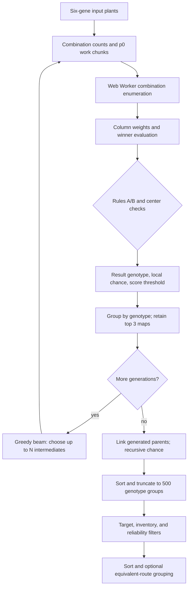

# GeneticsLab calculation and evaluation review

Reviewed: 2026-08-20  
Branch/commit: `master` @ `918d89c`  
Validation: `npm test` — 78/78 passing; `npm run build` — passing

## Purpose and scope

This is a handoff for a second technical/domain reviewer. It covers the active application path and the algorithms that calculate, prune, rank, or evaluate user-visible results:

- genetics weights and genotype scoring;
- combination counting/enumeration and Web Worker splitting;
- one-step crossbreeding, center handling, ties, and probability;
- result grouping, multi-generation selection, and route-tree linking;
- target, reliability, inventory, and recommendation evaluation;
- missing-donor and clone-utility heuristics;
- farm-output and recipe calculations;
- scanner/OCR evaluation heuristics.

The unused legacy `CalculatorPage`/`ResultsPanel` path is not treated as current behavior because `App.tsx` renders `WorkspaceLayout` for the calculator/workspace tab. No live-game experiment was performed, so game-mechanics questions are explicitly marked **domain validation required**.

## Executive verdict

The single-generation core is readable and internally consistent with the rebuild specification. The largest risk is not the column-weight arithmetic; it is the chain of target-blind pruning around it. The target is absent from the solver, multi-generation beam selection, and the 500-result truncation. A valid target route can therefore be generated but discarded before the target filter sees it, or never generated because the required intermediate was not selected.

The highest-priority code-proven concerns are:

1. target-blind beam selection plus a pre-target 500-result cap can hide reachable targets;
2. generation 3 drops generation-1 intermediates from its source pool;
3. worker errors silently produce incomplete results, and the spawn fallback can finish a generation early;
4. the default score threshold is applied before target matching and is not exposed in the active settings UI;
5. multi-generation chance is local/optimistic until final tree linking;
6. recipe raw-material totals are wrong in the UI for recipes with batch outputs;
7. OCR confidence `0` is replaced by a high fallback confidence;
8. the intended change-and-stability scanner gate cannot become true with the current detector interaction.

## Active calculation pipeline



## 1. Data model, weights, scores, and current options

### 1.1 Two unrelated weight systems

| Concept | Code | Current value/behavior |
|---|---|---|
| Valid genes | `src/domain/genetics/Gene.ts:1-5` | `G H Y W X` |
| Crossbreeding weight | `Gene.ts:7-16` | `G/H/Y = 0.6`; `W/X = 1.0` |
| Default preference score | `src/domain/genetics/Sapling.ts:5-11` | `G=1`, `Y=1`, `H=0.5`, `W=0`, `X=0` |
| Genotype score | `Sapling.ts:73-80` | Sum of six configured scores, rounded to 2 decimals |

Crossbreeding weights model which gene wins a column. Preference scores only decide which result genotypes are retained/ranked. A red gene has more crossbreeding influence while having a default preference score of zero.

The score is linear and position-free. With the defaults, `GGGYYY`, `YYYGGG`, and `GYGYGY` all score 6. Position and `G` versus `Y` preference only enter later through target matching.

### 1.2 Runtime defaults versus active UI exposure

| Option | Default | Active UI exposure | Effect |
|---|---:|---|---|
| `withRepetitions` | `true` | None found | Allows the same source index repeatedly among surrounding plants |
| Min surrounding plants | 2 | None found | Lower bound for combination size |
| Max surrounding plants | 3 | 2–4 slider/presets | Upper bound for combination size |
| Generations | 2 | 1–3 slider/presets | Beam depth |
| Added intermediates | 20 | Presets set 10/20/30 | Beam width |
| `minimumTrackedScore` | 4 | None found | Worker-side irreversible result filter |
| `geneScores` | defaults above | None found | Worker retention and ranking |
| `cpuLimitPercent` | 50 | None found | Worker duty-cycle ceiling |

Evidence: defaults are in `src/services/storageService.ts:152-171`; the active settings modal exposes only worker count, generations, and maximum surrounding plants in `src/components/modals/OptionsModal.tsx:107-169`.

`modifyMinimumTrackedScoreManually`, `inventoryMode`, `targetStopMode`, and `targetStopThresholdPercent` are stored option fields but have no behavior outside storage/type declarations. They should not be described as working solver features.

## 2. One-combination crossbreeding

Core function: `src/domain/genetics/crossbreeding.ts:84-179`.

### 2.1 Column weights

For each of six columns, `calculateColumnWeights`:

1. sums each observed gene type's weight across surrounding plants;
2. records contributor indexes per gene type;
3. finds the maximum total;
4. returns all types within `0.001` of that maximum.

Weights are rounded to two decimals after every addition (`crossbreeding.ts:49`). That is exact enough for the current 0.6/1.0 constants, but it becomes a hidden rule if weights are ever configurable.

Example: two `G` genes total 1.2 and beat one `W` at 1.0.

### 2.2 Tie classification and probability

```ts
isDefinitiveTie = winningTypes.length > 1 && maxWeight > 1.0
```

Source: `crossbreeding.ts:69-70`.

- Zero definitive ties: one result path.
- One definitive tied column: one branch per tied type; local chance is `1 / branchCount` (`crossbreeding.ts:222-253`).
- More than one definitive tied column: the entire combination is rejected (`crossbreeding.ts:105-108`).
- A tie whose maximum is `<= 1.0` is not branched. The first-seen winning type is selected and reported at chance 1 (`crossbreeding.ts:244-249`).

The last behavior is input-order dependent. Reordering the same source plants can change a `W=1.0` versus `X=1.0`, or single-green versus single-green, outcome. This matches the internal rebuild specification, but whether it matches current Rust gameplay is **domain validation required**.

Rule A deliberately excludes legal low-reliability paths if multiple tied columns can occur in-game. It is a product pruning rule, not an exhaustive probability model.

### 2.3 Rule B: every surrounding plant must contribute

The union of indexes contributing to any surrounding winning/tied type must cover every selected surrounding plant (`crossbreeding.ts:110-123`). This removes combinations containing a plant that does not affect the surrounding outcome.

The check runs before a center plant can override a column. A plant can therefore pass Rule B and later become useless after center overrides. The output is still genetically valid, but the stated minimality goal is only partially enforced.

### 2.4 Center handling

A concrete center is tried when:

```ts
surroundingCount <= 5 && someColumn.maxWeight <= 1.0
```

Source: `crossbreeding.ts:125-130`.

For each column, the center survives when its gene weight is greater than or equal to the winning surrounding total (`crossbreeding.ts:208-217`). If every surrounding maximum exceeds 1.0, no possible center gene can survive and no center search is needed.

Candidate centers exclude source indexes already present in the surrounding set (`crossbreeding.ts:152-162`). This conflicts with the practical meaning of `withRepetitions=true`: the same index may represent multiple surrounding plants, but another copy of it may not be used as center. Confirm whether an input row represents one physical plant or an indefinitely cloneable genotype.

Center evaluation is also the hot-path multiplier: every weak surrounding combination is evaluated against nearly every source plant.

### 2.5 Irreversible result filters

`buildMapsForOutcome` drops a result when:

- its genotype is already present in the current source pool (`crossbreeding.ts:259-262`); or
- its preference score is below `minimumTrackedScore` (`crossbreeding.ts:264-269`).

The target is not passed into this function. A perfect target scoring below 4 is permanently discarded before the UI can match it. In the active UI the threshold and score weights are not editable, which makes this a fixed product behavior rather than a practical user option.

## 3. Combination counts, enumeration, and work chunks

Source: `src/domain/genetics/combinations.ts`.

### 3.1 Counts

For each allowed surrounding count `k`:

- without repetition: `C(n, k)`;
- with repetition: `C(n+k-1, k)`.

For later generations, combinations containing only old sources are subtracted, ensuring at least one newly added intermediate is used (`combinations.ts:58-96`).

`binomialCoefficient` uses floating-point multiplication/division and rounds (`combinations.ts:24-33`). This is fine for current UI sizes but has no safe-integer guard for very large source lists.

### 3.2 Enumeration invariant

New intermediates are prepended, and later-generation enumeration requires `positions[0] < addedSaplings`. Because position arrays are monotonically sorted, that is equivalent to “contains at least one new intermediate.” This is correct only while the prepend ordering remains true (`orchestrator.ts:443-445`).

`getWorkChunks` emits a fixed-`k`, fixed-first-index (`p0`) slice with a closed-form count (`combinations.ts:198-263`). Workers advance inside that slice with `setNextPositionInChunk`.

The synchronous fallback uses the more general `setNextPosition`, but it executes exactly the closed-form number of combinations in each slice and does not advance after the slice's final item. The earlier draft's claim that this necessarily overlaps chunks was not supported and has been removed. End-to-end enumeration equivalence is still untested.

### 3.3 Chunk distribution

Chunks are assigned round-robin (`orchestrator.ts:192-196`). Slice sizes decrease with `p0`, so round-robin distributes the largest early slices across workers reasonably well. A size-aware queue may improve tail latency, but this should be measured before changing; it is not currently a demonstrated correctness issue.

`WORK_CHUNKS_PER_WORKER` and `chunkPlanner.worker.ts` are currently unused by the orchestrator.

## 4. Worker execution and orchestration

### 4.1 Silent incomplete results on worker error — high

`worker.onerror` only increments `completedWorkers` (`orchestrator.ts:250-256`). It does not retry the worker's chunks, report an error, or mark the result set incomplete. Once the remaining workers finish, the generation completes normally with missing portions of the search space.

### 4.2 Worker-construction fallback can finish early — high

If `new Worker(...)` throws, the catch path calls `runSynchronously(workerChunks, generationInfo)` (`orchestrator.ts:274-282`). That helper always calls `finishGeneration()` when its assigned subset finishes (`orchestrator.ts:288-353`). In a mixed pool, this can terminate still-running workers and advance the generation before their chunks are processed. The catch callback may then call `finishGeneration()` again.

The fallback helper needs a “process these chunks only” behavior; generation completion should remain owned by the pool coordinator.

### 4.3 Returned promise resolves before the full simulation — medium

`simulateBestGenetics` awaits generation 1 (`orchestrator.ts:108-126`), but `finishGeneration` starts later generations without awaiting or returning their promises (`orchestrator.ts:420-451`). Therefore callers cannot await the complete multi-generation run even though the public API returns `Promise<void>`.

### 4.4 ETA mixes incompatible windows — medium

`processedCombinationsInGen` resets each generation, while elapsed time is measured from whole-run `startTime` (`orchestrator.ts:365-373`). ETA is therefore increasingly inflated after generation 1. The unused `progressHistory` suggests a rolling-rate implementation was intended.

### 4.5 Default CPU cap is fixed from the active UI

Workers duty-cycle to honor `cpuLimitPercent` (`src/workers/crossbreeding.worker.ts:43-59,87-141`). The default is 50%, but the current Options modal has no CPU-limit control. Users can choose thread count while the independent 50% duty cycle remains hidden.

### 4.6 Redundant result transport — performance

Every worker sends new-map deltas every 250 ms, then sends its complete grouped result set at `DONE` (`crossbreeding.worker.ts:118-158`). The orchestrator ingests both (`orchestrator.ts:225-239`), so surviving maps are serialized, transferred, deserialized, and deduplicated twice.

## 5. Result grouping and retention

Source: `src/domain/genetics/sorting.ts`.

Results are grouped by genotype string. Each group retains at most three maps, sorted by:

1. lower result generation;
2. higher local chance;
3. lower sum of composing-parent generations;
4. fewer surrounding plants.

Group ordering then uses genotype score, recursive chance, result generation, composing-generation sum, and genotype text (`sorting.ts:34-60`).

Worker-local top-3 retention is safe before the main-thread merge: a map ranked below three maps in its own worker cannot enter the global top three under the same total ordering.

Duplicate detection compares local chance, surrounding count/order, center genotype, and surrounding genotypes (`sorting.ts:78-89`). It intentionally ignores tie metadata and generation indexes. This is probably harmless for currently enumerated plans but is not a complete structural route identity.

`getChanceProduct()` recursively follows `mapList[0]` for generated dependencies and rounds to four decimals at each node (`src/domain/genetics/GeneticsMap.ts:43-59`). It has no memoization, depth limit, or cycle guard. Current forward-only generations should prevent cycles, but the invariant is not asserted.

## 6. Multi-generation search

Source: `src/domain/genetics/generationSelection.ts`, driven by `orchestrator.ts:420-451`.

This is a greedy beam search, not a globally exhaustive multi-generation solver:

```text
generation 1: exhaustively search current source combinations
              retain up to N selected result genotypes
generation 2: search combinations using selected gen-1 results + originals
              retain up to N selected result genotypes
generation 3: search combinations using selected gen-2 results + originals
```

### 6.1 Target-blind beam selection — high

Candidates are sorted by generic score/chance/generation ordering. Pass 1 selects candidates that improve the best preference score in any column; pass 2 fills remaining slots by generic rank (`generationSelection.ts:58-96`). The target genotype and match mode are not inputs.

With default scores, `G` and `Y` are equally valuable. A `YYYYYY` target can lose required Y-rich intermediates to G-rich candidates. This is a direct cause of false “no route” outcomes at generation 2/3.

### 6.2 Generation 3 drops generation-1 intermediates — high

After candidate selection the code uses:

```ts
this.currentSourceSaplings = [...bestCandidates, ...this.originalSourceSaplings];
```

Source: `orchestrator.ts:443-445` and the identical skip path at `:468-470`.

At generation 3, `bestCandidates` contains generation-2 results and `originalSourceSaplings` contains only user input. Generation-1 intermediates are removed. Routes that need a generation-2 intermediate and a separate generation-1 intermediate in the final crossbreed cannot be found.

This also conflicts with the rebuild specification's instruction to prepend new candidates to the **existing** source list (`RUSTBREEDER_REBUILD_SPEC.md:744-752`). Decide whether the intended beam is cumulative or intentionally “latest generation plus originals.”

### 6.3 Reliability gate sees local probability only — high/medium

Candidate selection requires `bestMap.getChanceProduct() >= 0.5` (`generationSelection.ts:32,44-51`). Dependency links are not populated until final simulation completion (`orchestrator.ts:478-490`). During selection, `getChanceProduct()` therefore returns only the current map's local chance.

A locally certain generation-2 result built on a 50% generation-1 result passes as 1.0. More generally, the gate does not guarantee a recursively reliable route. Partial results, generation snapshots, skipped runs, and cancelled runs also expose unlinked optimistic probabilities; cancelled results are never linked (`CalculationContext.tsx:330-336`).

### 6.4 Beam diversity

The column-improvement first pass gives limited diversity, but the remaining beam is filled from one generic ranking. There is no target coverage, genotype-family quota, or near-miss reserve. Increasing the beam width reduces but does not remove greedy-search misses.

## 7. Post-solve route evaluation

### 7.1 The 500-result cap precedes target matching — high

`getSortedResults` sorts all groups by generic score/chance and slices to 500 (`orchestrator.ts:517-527`). Only afterward does `CalculationContext` apply the target (`CalculationContext.tsx:210-255`).

An exact target ranked 501st by generic score is invisible even if it was successfully generated. The target must be considered before truncation, or target-matching results must be reserved alongside the generic top list.

### 7.2 Target modes

`src/utils/targetMatch.ts` implements:

- **exact**: slot-by-slot; `*`, `?`, or missing slots are wildcards;
- **at least**: position-free multiset minimums;
- **best possible**: no filtering; helper metrics calculate multiset overlap and positional matches.

The helpers are clear and well tested. One naming caveat: `best-possible` does not itself select the `target` sort. The default `recommended` comparator considers target closeness only after score, chance, generation, and composing-generation cost (`routeScoring.ts:352-376`). The closest target is primary only when the user explicitly sorts by target (`routeScoring.ts:254-280`).

### 7.3 Reliability filter is hidden and rounded — medium

The UI keeps routes whose integer `probabilityPercent >= 50`, but falls back to the full list if none qualify (`CalculationContext.tsx:245-249`). Consequences:

- low-probability routes disappear without a toggle or count;
- behavior changes depending on whether any reliable route exists;
- the comparison uses a rounded percent, so a raw 49.5% route rounds to 50 and passes.

Use the raw probability if 50% is a real boundary.

### 7.4 Recommendation score is display-only and exceeds its stated component cap

`analyzeRoute` calculates:

```text
recommendation = probability*40 + generation(25|18|10)
               + inventory(20|10|2) + simplicity

simplicity = max(0, 15 - (uniqueClones-2)*2 - max(0, placements-4))
```

Source: `src/domain/genetics/routeScoring.ts:171-191`.

Problems:

- `recommended` sorting does not use `recommendationScore`; it uses genotype score first (`routeScoring.ts:352-376`), so displayed score and ordering can disagree.
- The comment says simplicity is worth “up to 15,” but one unique clone gives 17 and zero gives 19 because there is no upper clamp.
- `targetGeneString` is accepted by `analyzeRoute` but unused, so the recommendation is target-agnostic.
- The 40/25/20/15 weights and difficulty boundaries have no documented calibration data.

### 7.5 Inventory model needs a domain decision

`getRequiredSourceGenotypes` recursively counts every gen-0 leaf occurrence. Inventory then requires that many copies. The solver, however, defaults to combinations with replacement and can reuse one source index indefinitely.

Decide whether a saved/input clone means:

- one finite physical plant per quantity; or
- a reusable genotype from which the player can make enough clones.

The current solver and inventory analysis answer that question differently. Repeated generated intermediates also multiply dependency probability and source requirements, which may overstate cost if one successful intermediate can simply be cloned.

### 7.6 Equivalent-route grouping hides distinct genotypes by default

Routes are grouped by:

```text
score | rounded probability | generations | unique clones |
placements | inventory status
```

Source: `CalculationContext.tsx:29-44,257-277`.

The genotype, target closeness, missing-clone count, composing-generation cost, and actual parent set are absent. Distinct plans can collapse under one representative. This happens after exact/at-least filtering, so those filters are not bypassed, but in best-possible mode a materially different target candidate can be hidden. Users can disable grouping; the default is on.

## 8. Missing-donor and clone-utility heuristics

Source: `src/domain/genetics/missingGenes.ts`.

### 8.1 Missing donor analysis

For each constrained target slot, donor quantity is the sum of inventory quantities with the same gene in that position:

- 0 donors: critical;
- 1 donor: moderate;
- 2 or more: sufficient.

It then proposes one combined wildcard pattern and one single-slot pattern per weak slot. This is a positional availability heuristic, not a crossbreeding reachability calculation. It ignores the donor clone's other five genes, red-gene interference, center rules, and whether the proposed combined pattern exists. The 0/1/2 thresholds are not sourced.

### 8.2 Clone utility analysis misses multi-generation leaf use

The top ten raw result groups are inspected. Only each top map's immediate center and surrounding genotypes are counted (`missingGenes.ts:120-133`). Generated parents are not recursively expanded to the owned gen-0 clones needed to create them.

For multi-generation routes, a genuinely essential owned clone can therefore receive `LOW` or `REDUNDANT`. Ratings also use the generic raw top ten from `results`, not the user's filtered/target-sorted route list (`CloneValueAnalysis.tsx:24-30`).

## 9. Scanner/OCR evaluation algorithms

The active scanner flow is:

1. activity score gates each ROI at 0.25;
2. signature change/stability and a 200 ms timeout schedule OCR;
3. stitched-row OCR runs first, then six slot OCR calls as fallback;
4. results below average confidence 75 are rejected;
5. temporal voting requires 3 of the last 4 samples, exact or per-position;
6. visual/genotype dedup suppresses the continuously displayed plant.

### 9.1 Zero confidence is promoted to 88/85 — high

`TesseractGeneRecognizer` uses:

```ts
res.data.confidence || 88
res.data.confidence || (gene ? 85 : 0)
```

Source: `src/services/scanner/TesseractGeneRecognizer.ts:139-149,184-208`.

JavaScript treats a legitimate numeric confidence of `0` as false, so a zero-confidence but syntactically valid OCR result becomes 88 or 85 and passes the 75 threshold. Nullish fallback (`??`) would preserve zero. Temporal voting reduces one-frame harm but can confirm a stable repeated misread.

### 9.2 Change-and-stability conjunction is effectively unreachable — medium

The scheduling condition is:

```ts
(hasChanged && isStable) || now - lastOcr > 200
```

Source: `src/services/scannerService.ts:352-357`.

On a changed frame, `FrameStabilityDetector.registerFrame` resets its timer and returns false. On later stable frames, `RegionChangeDetector.hasChanged` returns false because it already stored the changed signature. With the same threshold, the two booleans do not become true together. OCR still runs through the 200 ms timeout, so the intended early stable-frame path is dead rather than the scanner being completely broken.

### 9.3 Empirical thresholds and diagnostics

Activity weights, 0.25 gating, 0.5% ROI change, 60 ms stability, confidence limits, glyph substitutions, and 3-of-4 voting are hard-coded heuristics. Unit tests verify their coded behavior, not accuracy against a labeled screenshot corpus.

`recognition.workerCount`, `idleWorkerTimeoutMs`, and `recommendedFpsCap` are unused. `rejectedCount` is displayed in diagnostics but never incremented. These do not change accepted genetics, but they make performance/quality diagnostics misleading.

## 10. Farm-output estimator

Source: `src/domain/planner/cropGrowthData.ts:109-165`.

Current formulas:

```text
totalPlants = planterCount * plantsPerPlanter
growthMultiplier = max(0.4, 1 - 0.09*G - 0.15 if optimal)
cycleMinutes = round(baseCycleMinutes * growthMultiplier)

yieldMultiplier = 1 + 0.25*Y + 0.20 if optimal
yieldPerPlant = round1(baseYieldPerPlant * yieldMultiplier)

waterEfficiency = max(0.65, 1 - 0.05*H)
waterLiters = round(totalPlants * mlPerMinute * cycleMinutes * waterEfficiency / 1000)
```

The UI clamps planter and plant counts to at least one. The function silently falls back to hemp for an unknown crop and ignores invalid/non-GYH genetics.

The database values and gene/optimal-condition multipliers are not sourced in code. `isEstimate: true` is returned, but a domain reviewer should confirm the values, whether effects are additive as modeled, and whether cycle-time rounding should occur before water calculation.

No farm-estimator tests exist.

## 11. Recipe expansion

Source: `src/domain/recipes/recipeEngine.ts`; active caller: `src/components/recipes/RecipesPage.tsx`.

The engine recursively expands crafted ingredients using:

```text
needed ingredient = ingredient.quantity * requested output / recipe output quantity
```

It consolidates equal raw items and rounds to two decimals at every recursion level.

### 11.1 Active UI passes the wrong requested output for batch recipes — high

The page displays direct ingredients and output multiplied by `multiplier`, but calculates raw materials with:

```ts
recipeEngine.expandItem(recipe.name, multiplier)
```

Source: `RecipesPage.tsx:239-245,292-313` and `:385-386,416-433`.

For `Low Grade Fuel`, one recipe craft consumes 3 animal fat + 1 cloth and displays output 4. At multiplier 1, the raw expansion asks for **1** fuel, returning 0.75 fat + 0.25 cloth, while the same card displays the ingredients for 4 fuel. The caller should request `recipe.output.quantity * multiplier` if “multiplier” means craft batches, as the rest of the UI indicates.

The existing recipe test calls `expandItem('Low Grade Fuel', 4)`, so it passes while the UI caller remains wrong.

### 11.2 Continuous versus whole-batch crafting

Nested expansion allows fractional batches. One explosive requires 3 low grade fuel, so the engine assigns 2.25 fat + 0.75 cloth. If Rust recipes must be crafted in whole batches, a craftable plan needs ceiling-by-batch and explicit leftovers. Confirm the desired semantics.

### 11.3 Structural limits

There is no cycle guard or memoization. The current static recipe graph is small and acyclic, so this is acceptable today. Add protection only if recipes become external/editable or the dataset grows.

## 12. Test and validation assessment

Current automated state:

- 9 test files, 78 tests: all passing;
- TypeScript and Vite production build: passing.

Good coverage exists for gene constants, basic scoring, representative crossbreeding rules, target helpers, route comparator modes, basic inventory scoring, recipe examples, temporal voting, dedup, and starvation hysteresis.

Important missing checks:

1. enumerate every combination exactly once, with/without replacement;
2. later-generation chunk coverage and sync/worker equivalence;
3. Web Worker errors, constructor fallback, cancellation, and skip;
4. end-to-end generation-2/3 source accumulation and target reachability;
5. tree linking and recursive probability in partial, cancelled, and final results;
6. target handling around the 500-group cap and score threshold;
7. route grouping with different target closeness/parent sets;
8. clone utility for recursive multi-generation leaves;
9. batch-output recipe UI totals and non-multiple quantities;
10. farm-output formulas and boundary inputs;
11. OCR confidence exactly zero;
12. integrated change/stability scheduling;
13. scanner accuracy against a labeled image corpus;
14. gameplay validation for tie, center, repetition, and probability rules.

## 13. Prioritized findings

| ID | Priority | Finding | Primary consequence |
|---|---|---|---|
| H1 | High | Target absent from worker/beam and 500-cap applied before target | Reachable exact targets can be missed/hidden |
| H2 | High | Gen-3 source resets to gen-2 candidates + originals | Routes needing separate gen-1 and gen-2 intermediates are impossible |
| H3 | High | Worker errors silently drop assigned chunks | Normal-looking but incomplete search results |
| H4 | High | Worker-construction fallback owns generation completion | Early termination/double completion in mixed fallback |
| H5 | High | Score threshold 4 runs before target and is not exposed | Low-generic-score target routes are irrecoverably discarded |
| H6 | High | Chance is unlinked/local until final completion | Optimistic selection, partial, skip, and cancel probabilities |
| H7 | High | Recipe UI requests one item instead of one output batch | Wrong raw totals for fuel, powder, and ammo batches |
| H8 | High | OCR confidence zero replaced with 88/85 | Low-confidence false scans can pass thresholds |
| Q1 | Domain | Ties at max `<=1.0` resolve first-seen at 100% | Possible order-dependent wrong genetics/probability |
| M1 | Medium | `withRepetitions` excludes same source index as center | Solver's clone-copy model is inconsistent |
| M2 | Medium | Reliability filter uses rounded integer and hidden fallback | 49.5% passes; visible semantics change silently |
| M3 | Medium | Recommendation score is not ranking and simplicity can exceed 15 | Displayed score disagrees with order/weights |
| M4 | Medium | Equivalent grouping omits genotype, target, and parent identity | Distinct useful routes hidden under one card |
| M5 | Medium | Clone utility does not recurse through generated parents | Essential base clones can be rated redundant |
| M6 | Medium | Full-run promise resolves after first generation | Callers cannot reliably await completion |
| M7 | Medium | ETA combines current-gen numerator with whole-run time | Inflated ETA after generation 1 |
| M8 | Medium | Scanner `hasChanged && isStable` path is dead | OCR scheduling relies on periodic timeout only |
| M9 | Medium | Default 50% CPU cap has no active UI control | Hidden performance ceiling |
| P1 | Performance | Worker sends deltas and full final groups | Duplicate serialization/merge work |
| P2 | Performance | Recursive chance recomputed during sorts/analysis | Avoidable main-thread cost on result updates |
| L1 | Low/currently bounded | Recipe recursion has no cycle guard/memoization | Unsafe only if recipe graph becomes editable/large |
| Q2 | Domain | Farm constants and additive formulas are unsourced | Numerical estimates may not reflect current game |

## 14. Questions to send to the other reviewer

1. In current Rust, what happens when two gene types tie at exactly 1.0 or 0.6? Is first-arrival deterministic, random, or timing-dependent?
2. Should combinations with two tied columns be excluded, or should all branches and their probabilities be represented?
3. Does `withRepetitions` mean one genotype can supply unlimited physical plants? If yes, may the same genotype also be center?
4. Should target matching influence worker retention and next-generation beam selection, or is generic “best genetics” intentionally primary?
5. For generation 3, should the source pool be cumulative (`gen2 + gen1 + originals`) or only latest intermediates plus originals?
6. When the same generated intermediate is needed twice, must its production probability/source cost be counted twice, or can one successful plant be cloned?
7. Is inventory quantity finite per placement, or does owning one genotype mean it is reusable?
8. Should the displayed recommendation score control “Recommended” sorting? If not, should it be removed/renamed?
9. Should sub-50% routes be hidden automatically, and should the boundary use raw rather than rounded probability?
10. Are recipe calculations supposed to show continuous material equivalents or whole craft batches with leftovers?
11. What authoritative values should the farm-output database and G/Y/H multipliers use?
12. Do we have labeled scanner captures to tune activity/confidence/voting thresholds and measure false-positive/false-negative rates?

## 15. Recommended validation order

1. Confirm the three game-model questions first: tie semantics, center/repetition semantics, and clone quantity/reuse.
2. Add one reference enumeration test and one generation-3 reachability fixture.
3. Make target-aware retention/capping decisions before performance tuning.
4. Add worker failure integration tests before changing the pool.
5. Fix the recipe batch caller and OCR zero-confidence fallback; both are isolated and code-proven.
6. Benchmark only after duplicate result transport and repeated recursive chance work are instrumented.
