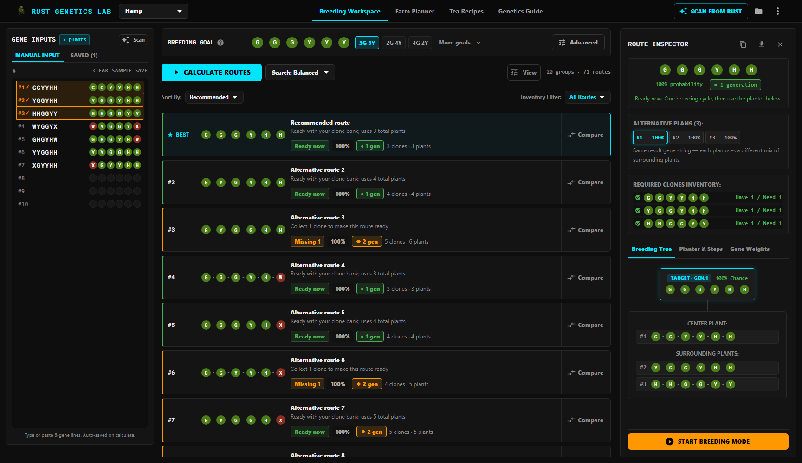
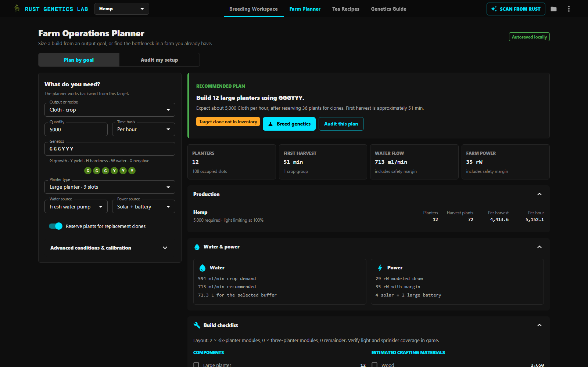
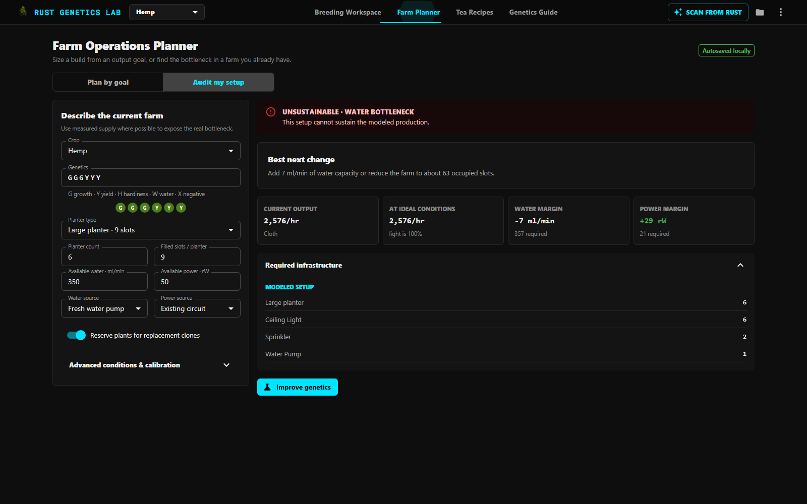

<div align="center">

# Rust Genetics Lab

**Inventory-aware breeding routes and practical farm plans for Rust.**

[](package.json)


[](src/tests)
[](LICENSE)
[](https://github.com/JawadYzbk/rust-genetics-lab/stargazers)

Turn a clone box into a breeding route. Size the farm, find its bottleneck, and carry the plan into the game.

</div>



<details>
<summary>Additional screenshots</summary>


</details>

Rust Genetics Lab combines clone inventory management, target design, route calculation, farm planning, and step-by-step execution in one workspace. It runs as a standalone web app and inside RustPlusDesktop.

> [!NOTE]
> Rust Genetics Lab is an unofficial community project. It is not affiliated with or endorsed by Facepunch Studios.

## Highlights

| Capability | What it provides |
| --- | --- |
| Inventory-aware solver | Ranks single-generation and multi-generation routes against the clones you own, including missing-clone requirements. |
| Flexible breeding goals | Choose a preset, enter an exact six-gene target, require minimum genes, or search for the best available result. |
| Actionable route inspector | Review probability, required clones, storage positions, source-row highlights, planter placement, breeding order, and lineage. |
| Search controls | Switch between fast, balanced, and thorough calculation profiles, then sort, filter, group, or compare the results. |
| OCR scanner | Capture genetics from Rust with calibration, correction, preview, and reusable scanner presets. |
| Breeding Mode | Follow a route in game through a focused sequence of planting and confirmation steps. |
| Goal-based farm planner | Start with cloth, berries, tea, food, or pie output. Get the required crops, planters, clone reserve, first harvest, and steady production. |
| Farm setup audit | Enter an existing farm's water, power, slots, genetics, and conditions. The audit names the limiting system and the smallest useful correction. |
| Build requirements | Generate planter modules, water and power demand, component counts, estimated crafting materials, and a checklist that can be copied, printed, or exported. |
| Connected tools | Expand recipe goals through the recipe engine, check owned clones, or send missing genetics straight to the Breeding Workspace. |

## Workflow

1. Enter clone genetics manually, paste a list, restore a saved set, or scan from Rust.
2. Select the plant type and define the breeding goal.
3. Calculate routes and choose the best plan for the clones currently available.
4. Check the breeding tree or planter layout, then start Breeding Mode.

The clone numbers shown in a route match their positions in the input list, which makes the list usable as a direct model of an in-game storage box.

## Farm Operations Planner

The planner works backward from a production target. Choose the output, quantity, time window, genetics, planter type, and infrastructure assumptions. The result separates community crop estimates from user-measured calibration and keeps water flow distinct from electrical power.

### Plan by goal

Size a farm for a raw crop or an existing tea and food recipe. The recommendation includes planter allocation, clone reserve, first harvest, output rate, water, power, layout modules, and a build checklist.



### Audit an existing setup

Enter measured water and power capacity to test a farm before expanding it. The audit identifies the primary bottleneck, shows the margin, and recommends a concrete correction.



Farm drafts and checklist progress are saved locally. Plans can move directly into the recipe browser or Breeding Workspace without re-entering the target.

## Getting started

### Prerequisites

- A current [Node.js](https://nodejs.org/) LTS release
- npm

### Install and run

```bash
git clone https://github.com/JawadYzbk/rust-genetics-lab.git
cd rust-genetics-lab
npm ci
npm run dev
```

Open the local URL printed by Vite.

### Available commands

| Command | Purpose |
| --- | --- |
| `npm run dev` | Start the Vite development server. |
| `npm run build` | Type-check the project and create a production build. |
| `npm run preview` | Serve the production build locally. |
| `npm test` | Run the Vitest test suite once. |

## Desktop integration

The standalone build supports the complete planning workflow in a browser. When hosted by RustPlusDesktop through WebView2, the same interface can use the desktop scanner bridge for a tighter capture workflow.

## Privacy

Genetics, saved sets, projects, and settings are stored locally in the browser. OCR and route calculation run on the device. Anonymous usage analytics is enabled by default and can be disabled at any time from the privacy settings.

## Technology

- [React](https://react.dev/) and [TypeScript](https://www.typescriptlang.org/)
- [Vite](https://vite.dev/)
- [Material UI](https://mui.com/) and [Emotion](https://emotion.sh/)
- [Tesseract.js](https://tesseract.projectnaptha.com/) for client-side OCR
- Web Workers for solver concurrency
- [Vitest](https://vitest.dev/) for automated tests

## Contributing

Issues and focused pull requests are welcome. Before submitting a change, run:

```bash
npm test
npm run build
```

Please include a short explanation of the user-facing change and screenshots for visual updates.

## Acknowledgements

Rust Breeder inspired the project's early direction. Rust Genetics Lab has since grown into an independent solver and breeding workspace.

## License

Copyright 2026 Jawad Yazbek and contributors.

Licensed under the [Creative Commons Attribution-NonCommercial-ShareAlike 4.0 International License](LICENSE). Commercial use is not permitted, and derivative work must use the same license.
